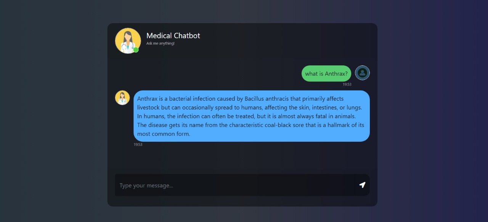

# MediBot-AI: Medical Question Answering Chatbot

MediBot-AI is a sophisticated, retrieval-augmented generation (RAG) based chatbot designed to answer medical questions. It leverages a local medical document (PDF) as its knowledge base, providing accurate and contextually relevant answers through a user-friendly web interface.

## 🖼️ Chatbot UI Preview



## ✨ Features

- **PDF Data Processing**: Extracts text directly from PDF documents in the `Data/` directory.
- **Advanced Text Processing**: Splits documents into manageable chunks for efficient embedding.
- **High-Quality Embeddings**: Utilizes Hugging Face Sentence Transformers to generate dense vector embeddings for semantic understanding.
- **Efficient Vector Storage**: Stores and indexes embeddings in [Pinecone](https://www.pinecone.io/) for fast and scalable similarity searches.
- **Powerful Language Model**: Uses the fast and powerful [Groq](https://groq.com/) API with LLaMA models to generate human-like responses.
- **Retrieval-Augmented Generation (RAG)**: Employs a robust RAG pipeline orchestrated by [LangChain](https://www.langchain.com/) to retrieve relevant information before generating an answer.
- **Interactive Web UI**: A simple and clean user interface built with Flask and basic HTML/CSS.

## ⚙️ How It Works

The project operates in two main stages:

1.  **Data Indexing (`store_index.py`)**:
    *   The medical PDF from the `/Data` folder is loaded and parsed.
    *   The extracted text is divided into smaller, coherent chunks.
    *   Each chunk is converted into a numerical vector (embedding) using Sentence Transformers.
    *   These embeddings are then uploaded and indexed in a Pinecone vector database. This is a one-time process for each new dataset.

2.  **Inference & Chat (`app.py`)**:
    *   The Flask application starts, initializing the connection to Pinecone and the Groq LLM.
    *   When you ask a question, the app converts your query into an embedding.
    *   This embedding is used to search the Pinecone index for the most similar (i.e., most relevant) text chunks from the medical book.
    *   The retrieved chunks and your original question are passed to the Groq LLM within a carefully crafted prompt.
    *   The LLM generates a final answer based on the provided context and serves it to you in the chat interface.

## 🚀 Getting Started

Follow these instructions to set up and run the project on your local machine.

### Prerequisites

- Python 3.8+
- A [Pinecone API Key](https://www.pinecone.io/)
- A [Groq API Key](https://console.groq.com/keys)

### Installation & Setup

1.  **Clone the Repository**
    ```bash
    git clone https://github.com/your-username/MediBot-AI.git
    cd MediBot-AI
    ```

2.  **Create a Virtual Environment**
    It's recommended to use a virtual environment to manage dependencies.
    ```bash
    python -m venv venv
    source venv/bin/activate  # On Windows: venv\Scripts\activate
    ```

3.  **Install Dependencies**
    ```bash
    pip install -r requirements.txt
    ```

4.  **Set Up Environment Variables**
    Create a file named `.env` in the root directory of the project and add your API keys:
    ```
    PINECONE_API_KEY="YOUR_PINECONE_API_KEY"
    GROQ_API_KEY="YOUR_GROQ_API_KEY"
    ```

5.  **Add Your Data**
    Place your medical PDF file inside the `Data/` directory. The application is configured to load the first PDF it finds in this folder.

6.  **Create the Vector Store**
    Run the `store_index.py` script to process your PDF and populate the Pinecone index. This may take a few minutes depending on the size of your document.
    ```bash
    python store_index.py
    ```

## Usage

Once the setup is complete, you can start the chatbot application.

1.  **Run the Flask App**
    ```bash
    python app.py
    ```

2.  **Access the Chatbot**
    Open your web browser and navigate to:
    ```
    http://127.0.0.1:8080
    ```

You can now start asking medical questions!

## License

This project is licensed under the MIT License. See the [LICENSE](LICENSE) file for details.